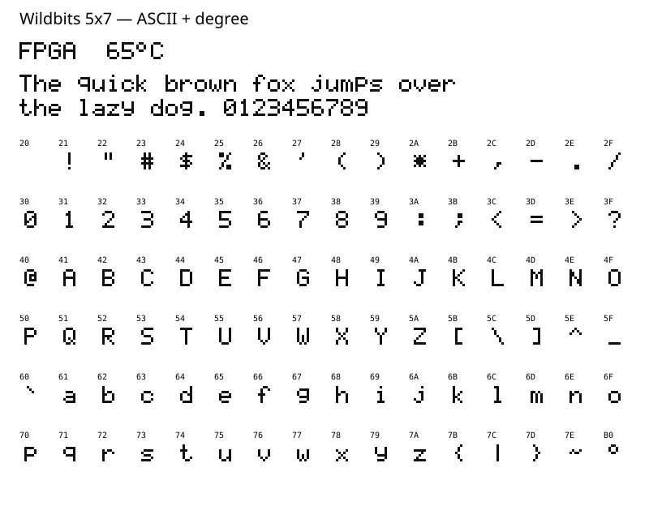

# Wildbits 5x7

A small monochrome bitmap font for FPGA displays and embedded software.
96 glyphs: printable ASCII (`0x20`–`0x7E`) plus the degree symbol (`0xB0`).
Uppercase, lowercase, digits and punctuation share a 5×7 pixel box.



This is the custom font used by AExp-K2's FPGA-temperature footer, expanded
into a complete printable-ASCII set. Its original temperature glyphs are
unchanged. It is not an Amiga ROM font or an imported desktop typeface.

## Reuse

Copy this directory into another project, or copy just the required generated
file **and [LICENSE](LICENSE)**. The font, generator, exports and tests in this
directory are MIT-licensed; this does not change the license of AExp or its
other assets. There are no dependencies on K2, QNICE, an LCD controller or the
Amiga core. Generated files are checked in, so consumers do not need Python.

### FPGA: Verilog-2001

Add [generated/wb_font5x7.v](generated/wb_font5x7.v) to the project's sources:

```verilog
wire [34:0] glyph;
wb_font5x7 font (.char_i(character), .glyph_o(glyph));
// character: unsigned 8-bit code; x/y: local glyph coordinates.
assign ink = (x < 5 && y < 7) ? glyph[34 - y*5 - x] : 1'b0;
```

The lookup is combinational: no clock, reset or added pipeline cycle. Register
its output in the consuming renderer if needed for timing. Bit 34 is top-left,
bit 0 bottom-right; rows run left to right, top to bottom. The 96×35-bit ROM
has inline initialization, no external memory file and no vendor primitives.
The `rom_style = "distributed"` hint keeps it out of BRAM in Vivado. Other FPGA
tools must support initialized ROM inference; check mapping/timing there.

The font does not implement layout, scaling, colors or a framebuffer. Use a
six-pixel horizontal advance (five ink columns plus one blank) and an eight-pixel
line height. For crisp integer scaling, repeat each pixel in both dimensions;
at 3×, each cell is 18 pixels wide and the ink is 15×21 pixels. Ensure the
spacing column stays blank rather than indexing beyond the glyph.

### Embedded software: C99 / C++11

Include [generated/wb_font5x7.h](generated/wb_font5x7.h):

```c
#include "wb_font5x7.h"

/* Draw 'A' at the origin. Supply your display's put_pixel implementation. */
for (unsigned y = 0; y < WB_FONT5X7_HEIGHT; ++y)
    for (unsigned x = 0; x < WB_FONT5X7_WIDTH; ++x)
        put_pixel(x, y, wb_font5x7_pixel('A', x, y));
```

The header provides a 672-byte `static const` table: seven row bytes per glyph,
bit 4 leftmost and bit 0 rightmost. `wb_font5x7_row(codepoint, y)` returns a row;
`wb_font5x7_pixel(codepoint, x, y)` returns 0 or 1. Out-of-bounds coordinates
return 0. No allocation or runtime initialization is needed. Memory placement
is the toolchain's responsibility; Harvard-memory targets may need a flash
storage/access adaptation.

### Character encoding

Both exports map unsupported characters to `?`. Space is blank. Control codes,
including newline, are **not** layout commands: handle them in the caller.
For the degree symbol, pass `8'hB0` in HDL or `WB_FONT5X7_DEGREE` in C/C++.
This is not a UTF-8 decoder: the UTF-8 byte sequence `C2 B0` must first be
decoded to U+00B0. Cast ASCII string bytes to `unsigned char` before passing
them to the C helpers. Accented letters and other Unicode glyphs are absent.

## Editing and verification

[font.json](font.json) is the single source of truth. Each glyph contains seven
slash-separated rows of five bits, leftmost pixel first. Edit that file, then
run these commands from this directory (Python 3 standard library only):

```sh
python3 generate.py          # Rebuild Verilog, C header and SVG specimen
python3 generate.py --check  # Fail if any checked-in export is stale
python3 test.py              # Validate source and all 256 byte codes in C/C++
python3 test.py --hdl vivado # Also simulate Verilog; source Vivado settings first
# Alternatively: python3 test.py --hdl iverilog
```

The C/C++ tests require `cc` and `c++`. HDL tests compare all 256 lookup results
against canonical glyph data, including fallback and pixel orientation.
Temporary test artifacts are retained under `/tmp/wb-font5x7-*`.

Optional Artix-7 synthesis probe, run from a scratch directory with Vivado on
PATH (replace the source path with your checkout):

```sh
vivado -mode batch -nojournal -source /path/to/font5x7/tests/synth.tcl
```

Verified on 2026-09-12: strict C99/C++11 builds and Vivado Verilog-2001 simulation
pass. Standalone synthesis of the complete font with input/output registers
uses 79 LUTs, 43 FFs and zero BRAM/DSP on `xc7a200tfbg676-2`; estimated setup
slack is +7.446 ns at 100 MHz. These are synthesis estimates, not routed timing
or a guarantee for other targets. The registers belong to the test wrapper,
not the font module. AExp-K2's independent golden-footer and LCD SPI tests
also pass with this shared font; the refactor still needs a full core build
and hardware test.
